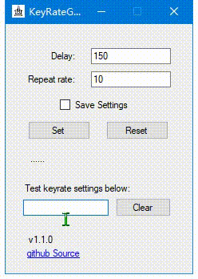

# KeyRateGUI

Lightweight GUI tool to help you input keys faster.

## Introduction

This project is a lightweight tool designed for Windows that allows users to customize the response speed and repetition rate when holding down a key on the keyboard. By setting the delay time before the repetition starts and the interval between repetitions, users can enhance their typing experience and increase efficiency.

## Install

Get latest release executable [here](https://github.com/NumberPigeon/keyrateGUI/releases/download/v1.1/KeyRateGUI.exe). 

**WARNING**: This executable will write a *config.ini* to the directory. In some cases it will override the existing config.ini file used by other software. It’s better to put the executable under a separate directory to avoid conflicts.

## Usage

A demonstration is shown in the following gif:

The usage is simple:

1. Set the **Delay** (the waiting time in milliseconds before the repetition starts after holding down a key)
2. Set the **Repeat Rate** (the repetition interval in milliseconds between each repetition)
3. Optionally check **Save Settings** if you want to remember your personalized settings
4. Click **Set** button. Now you are good to enjoy fast key inputs.
5. Test your settings at the textarea, and click **Clear** to delete all texts in the area.
6. Adjust your settings until you are satisfied, or click **Reset** to restore key settings to the system default.

## Acknowledgments

- This project was inspired by [keyrate](https://github.com/EricTetz/keyrate). Try it if you need a cli version.

## Requirements:

- Windows10 (other windows system untested)
- .net framework 4.0+ (Normally integrated with Windows10)

## Known Issues

- When used under Windows7, it may stuck on pressing shift when switching between full-screen applications, for example Starcraft2.

